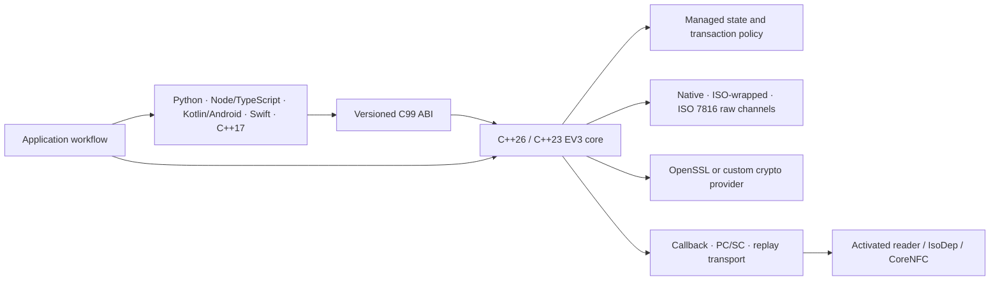

<div align="center">

# DESFire EV3 SDK

**One protocol core for native, ISO-wrapped native, and ISO 7816 integrations.**

An independently authored EV3 SDK for C++26/C++23, C, C++17, Python, Node.js/TypeScript,
Kotlin/JVM, Android, and Swift.

[](LICENSE)
[](https://github.com/GtechGovind/desfire-sdk/actions/workflows/native.yml)
[](https://github.com/GtechGovind/desfire-sdk/actions/workflows/bindings.yml)
[](https://github.com/GtechGovind/desfire-sdk/actions/workflows/sanitizers.yml)
[](https://github.com/GtechGovind/desfire-sdk/actions/workflows/codeql.yml)
[](https://github.com/GtechGovind/desfire-sdk/actions/workflows/quality.yml)


[Why this SDK](#what-makes-it-useful) · [Architecture](#architecture) ·
[Get started](#get-started) · [SDKs](#language-sdks) · [Documentation](#documentation) ·
[Project status](#project-status)

</div>

> [!IMPORTANT]
> This repository is a development release. Retained host, replay, cross-compilation, sanitizer,
> and binding evidence does not replace acceptance on the intended EV3 card, reader, RF environment,
> mobile device, key infrastructure, or certified product configuration. The qualification record
> identifies the exact source revision and evidence behind every current claim.
> No public Maven, PyPI, npm, XCFramework, AAR, or desktop binary release exists yet; current
> consumers build from source.

DESFire EV3 SDK gives integrators one protocol implementation instead of separate wire encoders in
every application language. It is designed for transit, access control, ticketing, identity, and
secure NFC systems that need both productive application workflows and exact protocol control.

This is an independent open-source project. It is not an NXP product, is not affiliated with or
endorsed by NXP, and does not distribute restricted NXP material, card keys, or reader firmware.

## What makes it useful

| Need | What the SDK provides |
| --- | --- |
| One protocol implementation | Native, ISO-wrapped native, and ISO 7816 APDU encoding live in the C++ core; bindings do not recreate wire logic. |
| Friendly and expert access | Managed operations provide typed state and transaction rules, while separately owned raw channels preserve exact status and response bytes. |
| Safe mutation handling | Failures preserve whether an operation was not sent, rejected, or has an unknown outcome that requires reconciliation; a normal checked return confirms success. |
| Flexible key custody | Use an already-derived AES-128 key, a custom derivation strategy, or a non-secret reference resolved by a key provider before card I/O. |
| Broad compiler support | The core targets C++26 with a tested C++23 mode; C++17 uses a typed facade over the versioned C99 ABI. |
| Cross-language parity | A canonical 120-operation manifest indexes and checks parity across the C, C++17, Python, Node, Kotlin, Android, and Swift surfaces. |
| Reviewable evidence | Exact-frame tests, known-answer cryptographic fixtures, parser stress, sanitizers, ABI checks, static analysis, and package consumers run in CI. |

## Architecture



The core keeps protocol encoding, authentication state, secure messaging, and transport ownership
in one place. Managed and raw channels must not share the same activated transport concurrently.

## Choose an API

| Consumer | Entry point | Package or target | Guide |
| --- | --- | --- | --- |
| Modern C++ | `<desfire/ev3/ev3.hpp>` | `desfire::ev3_core` with C++26 or C++23 | [Reader integration](docs/reader-integration.md) |
| C | `<desfire.h>` | `desfire::c`, self-contained C99 headers and ABI v1 | [C API](c-api/README.md) |
| C++17 | `<desfire/cpp17.hpp>` | `desfire::cpp17`, typed RAII facade over `desfire::c` | [C++17](sdk/cpp17/README.md) |
| Python 3.10+ | `import desfire_ev3` | synchronous `Card`, `AsyncCard`, and `desfire_ev3.raw` | [Python](sdk/python/README.md) |
| Node.js 20+ | `@desfire/ev3` | strict TypeScript, Promise APIs, worker-isolated native calls, and `/raw` | [Node](sdk/node/README.md) |
| Kotlin/JVM | `com.desfire.ev3` | suspend-first `Card`, explicit `BlockingCard`, and raw access | [Kotlin](sdk/kotlin/README.md) |
| Android API 23+ | `com.desfire.ev3.android` | `AndroidCardSession` and `IsoDepTransport` | [Android](sdk/android/README.md) |
| Swift 6 | `import DesfireEV3` | async APIs, `RawCard`, and separate `DesfireEV3CoreNFC` product | [Swift](sdk/apple/README.md) |

Applications using pre-C++17 toolchains can call the C99 ABI directly.

## Capabilities

| Domain | Supported surface |
| --- | --- |
| Framing | Direct native, proprietary `90 INS` ISO-wrapped native, ISO 7816 APDUs, bounded additional-frame exchange |
| Authentication | Standard AES `0xAA`, EV2 First AES with zero to six PCD capability bytes, EV2 NonFirst AES, and ISO AES |
| Secure messaging | Standard-AES chained-IV and EV2 Plain, MAC, and Full exchanges with explicit command policies |
| Applications and keys | Select, create, delete, delegated application workflows, key settings/version, key changes, and key-set lifecycle |
| Files | Standard and backup data, value, linear/cyclic record, transaction-MAC files, settings, reads, writes, and value operations |
| Transactions | Credit, debit, limited credit, bounded batches, abort, commit, ReaderID commit, and optional transaction-MAC receipt |
| ISO 7816 | Select, binary and record I/O, challenge, authentication APDUs, short/extended lengths, `61xx` continuation, and safe read-only `6Cxx` correction |
| Offline AES | AN10922 diversification, delegated-application cryptograms, originality verification, transaction-MAC helpers, and MIFARE Classic license MAC |
| Expert access | Exact native and ISO exchange plus explicit Standard AES, EV2, and ISO AES raw-session policies |

The [implementation matrix](spec/coverage.md) is the source of truth for typed support. The
[qualification record](spec/qualification-record.yaml) is the source of truth for evidence tied
to the current revision. Raw transport access does not turn an undocumented opcode into a
supported typed operation.

## Get started

### Build and test the native SDK

You need CMake 3.25 or newer, Ninja, a compiler with the requested C++ mode, and OpenSSL 3.5 or
newer. PC/SC is enabled by default and requires the platform PC/SC development package; disable it
for a card-free first build.

```sh
git clone https://github.com/GtechGovind/desfire-sdk.git
cd desfire-sdk

cmake -S . -B build/local -G Ninja \
  -DCMAKE_BUILD_TYPE=Release \
  -DDESFIRE_CXX_STANDARD=23 \
  -DDESFIRE_BUILD_PCSC=OFF
cmake --build build/local --parallel
ctest --test-dir build/local --output-on-failure
cmake --install build/local --prefix "$PWD/build/install"
```

`cmake --preset release` selects C++26 and fails during configuration when the compiler cannot
provide the required language mode. Use `cmake --preset compat23` for the maintained compatibility
configuration. See the [build guide](docs/build.md) for platform prerequisites, providers,
transports, sanitizers, documentation, and packaging options.

### Consume an installed package

```cmake
find_package(desfire-sdk CONFIG REQUIRED)

add_executable(ticketing-service main.cpp)
target_link_libraries(ticketing-service PRIVATE desfire::ev3_core)
target_compile_features(ticketing-service PRIVATE cxx_std_23)
```

Choose `desfire::c` for C99 consumers or `desfire::cpp17` for the C++17 facade. Compile
requirements remain target-local, so the native core's C++ mode does not propagate through those
interfaces.

### Try a card-free operation

This C++17 example exercises the real native library while requiring no reader or production key:

```cpp
#include <desfire/cpp17.hpp>

#include <iostream>

int main() {
    using namespace desfire::cpp17;
    auto key = Aes128Key::import(Bytes(16));
    if (!key) {
        return 1;
    }

    auto diversified =
        offline::derive_nxp_aes128(key.value(), Bytes{0x04, 0x11, 0x22, 0x33, 0x44, 0x55, 0x66});
    if (!diversified) {
        std::cerr << diversified.error().message << '\n';
        return 2;
    }
    std::cout << "Derived AES-128 key: " << diversified.value().size() << " bytes\n";
}
```

C, C++17, Python, Node, Kotlin, Android, and Swift examples and compile checks are indexed in
[examples/README.md](examples/README.md).

### Connect a reader

A reader integration follows the same lifecycle in every language:

1. Activate the card with the platform reader API and create a transport for that activation.
2. Create one managed `Card` or one separately owned raw channel.
3. Select the intended application and resolve all authentication keys before the first card frame.
4. Authenticate with the explicit Standard AES, EV2 First, EV2 NonFirst, or ISO AES method.
5. Execute typed operations or an explicit transaction batch and inspect both status and outcome.
6. Close the card before releasing the transport and reader callback context.

The [transport lifecycle guide](docs/architecture/transport-lifecycle.md) defines cancellation,
reentry, deadlines, callback ownership, and recovery after a timed-out reader.
The [reader integration guide](docs/reader-integration.md) includes a complete read-only PC/SC
example and a callback adapter template.

## Key integration

| Key source | Use it when | Card-I/O behavior |
| --- | --- | --- |
| Direct | Your application already has the final scoped AES-128 key | The SDK validates and copies the 16-byte key into temporary secure storage |
| Derived | You have a master key and application-specific diversification logic | The selected deriver produces the final key before the first card frame |
| Provider | A vault or application service maps a non-secret reference to an exportable key | Resolution runs inside the operation admission boundary; failure returns `not_sent` |

Temporary native key copies are wiped on exit paths, and key values, references, and
diversification context are excluded from logging. This release accepts exportable 16-byte AES
keys. Opaque SAM/HSM-backed session primitives need a separate provider contract and are outside
the current surface. Read [key resolution](docs/architecture/key-resolution.md) before connecting a
production keystore. Kotlin integrations that require the optional GKey compatibility layout can
use [`GKeyDerivation`](docs/architecture/gkey-derivation.md) or its caller-owned provider scoped to
one session; the SDK contains no seed or default key.

## Transaction safety

Transport errors alone cannot tell an application whether a card mutation happened. Every SDK
preserves a delivery outcome with the error and card status:

| Outcome | Meaning | Application action |
| --- | --- | --- |
| `not_sent` | No card frame was transmitted | Correct the input or retry according to application policy |
| `rejected` | The card returned a definite failure | Handle the reported native or ISO status |
| `succeeded` | The operation completed with a success status | Continue and persist the receipt or resulting state |
| `unknown` | Transmission may have started, but completion is unconfirmed | Stop automatic mutation retries and reconcile durable card/application state |

Managed transaction plans hold one logical operation boundary across staged mutations and commit.
They do not blindly retry after transmission. See [raw and managed APIs](docs/architecture/raw-and-managed-apis.md)
and the [API contract](docs/api-contract.md) for state and cancellation rules.

## Language SDKs

| SDK | Developer model | Verification scope | Guide |
| --- | --- | --- | --- |
| C | 125-symbol ABI v1 baseline, opaque handles, owned immutable buffers, callback transports | C99 runtime, C11 layout, header isolation, exports, ownership, reentry | [C](docs/bindings/c.md) |
| C++17 | Header-only typed RAII facade with Result and optional throwing adapter | normal, `-fno-exceptions`, throwing, installed-consumer, known-answer tests | [C++17](docs/bindings/cpp17.md) |
| Python | Typed synchronous and dedicated-thread asynchronous cards | 28 tests on Python 3.10 and 3.14, mypy, Ruff, wheel/sdist installation | [Python](docs/bindings/python.md) |
| Node/TypeScript | Strict TypeScript with one native worker per card | 20 native tests on Node 20, 22, 24, and 26 on Linux, package verification | [Node](docs/bindings/node-typescript.md) |
| Kotlin/JVM | Suspend-first card queue plus explicit blocking facade | C++23/C++26 JNI conformance, cancellation, reentry, JCE fixtures | [Kotlin](docs/bindings/kotlin-android.md) |
| Android | Owned `IsoDep` session with explicit cancellation and no hidden reconnect | AAR cross-build for ARM64, ARMv7, and x86_64; lint and package checks | [Android](sdk/android/README.md) |
| Swift | Swift concurrency over a private serial native executor | 14 macOS tests and iOS 16 device/simulator source builds | [Swift](docs/bindings/swift.md) |

The platform and hardware boundaries are recorded in [spec/coverage.md](spec/coverage.md).
Current-revision results and any pending acceptance rows are recorded in
[spec/qualification-record.yaml](spec/qualification-record.yaml).

## Verification

| Workflow | What it checks |
| --- | --- |
| Native | C++23/C++26 builds on Linux, macOS, and Windows; C/C++ consumers and package installation |
| Bindings | Generated parity, Kotlin/JNI, Python, Node/TypeScript, and Swift host conformance |
| Sanitizers | AddressSanitizer, UndefinedBehaviorSanitizer, ThreadSanitizer, and repeated race scenarios |
| Quality | Formatting, API coverage, complete C/C++ documentation, generated-file parity, and release policy |
| CodeQL and security | CodeQL, dependency review, secret scanning, supply-chain policy, and scheduled analysis |
| Android | Three ABI native builds, exact exports/dependencies, 16 KiB 64-bit ELF and APK alignment, lint, Android-test execution, APK verification, and AAR contents |

The host suite verifies exact frames, cryptographic known answers, malformed input handling,
session transitions, additional-frame bounds, lost-response outcomes, callback races, ABI layout,
and deterministic parser stress. Read [testing and qualification](docs/testing.md) for commands,
recorded evidence, and the physical-target acceptance checklist.

## Documentation

The [documentation index](docs/README.md) organizes the integration, architecture, binding,
security, qualification, and release guides. Useful starting points are:

- [Build and install](docs/build.md)
- [Reader integration](docs/reader-integration.md)
- [Core API contract](docs/api-contract.md)
- [Architecture and ownership](docs/architecture.md)
- [Command and binding coverage](spec/coverage.md)
- [Examples by language](examples/README.md)
- [Hardware acceptance](docs/qualification/hardware-acceptance.md)
- [Security policy](SECURITY.md)

All public C/C++ declarations and matching definitions are checked for Doxygen contracts. The
canonical API schema generates cross-language operation inventories and Node declarations; binding
guides document the typed workflows, ownership, threading, cancellation, and qualification limits.

## Project status

The implemented surface is substantial, but this project deliberately fails closed where the
available material does not define an authoritative layout. The following areas are unavailable:

- SDM conditional parsing, provisioning, mirroring, and verification;
- automatic EV3 transaction-MAC input construction (callers supply complete authoritative TMI);
- SAK, virtual-card identifier, and delegated option-6 configuration payloads;
- proximity-check, virtual-card selection, card-emulation, and AuthenticatePDC workflows;
- managed native DES/2K3DES/3K3DES and managed ISO TDEA authentication;
- opaque SAM/HSM session primitives, production key injection, and certification tooling.

CI package artifacts are verification evidence rather than a supported distribution channel.

The qualification record binds software evidence to a specific source revision and retains hosted
run links where available. It makes no claim of physical EV3 interoperability, reader qualification,
RF timing acceptance, production key custody, Android/CoreNFC device behavior, or product
certification until those rows pass. Record those results for the exact card, reader firmware,
mobile device, and application policy before deploying the SDK in production.

For authoritative product documentation and certified integrations, use the official NXP material
available under your organization's applicable license and access terms.

## Contributing

Start with [CONTRIBUTING.md](CONTRIBUTING.md), the [coding standards](docs/coding-standards.md), and
the [governance model](GOVERNANCE.md). Bug reports should include a minimal redacted reproduction,
expected and observed status/outcome, transport type, and whether a physical card or replay fixture
was used. Never attach keys, production or private diversification inputs, personal card data, or
proprietary documents. Synthetic test vectors are welcome when they contain no deployed material.

Security issues belong in the private process described by [SECURITY.md](SECURITY.md). General
integration help is covered by [SUPPORT.md](SUPPORT.md).

## License

Licensed under [Apache License 2.0](LICENSE). Third-party build and distribution notices are listed
in [docs/dependencies.md](docs/dependencies.md).
